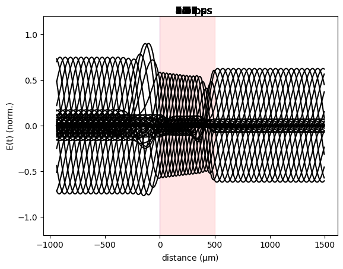
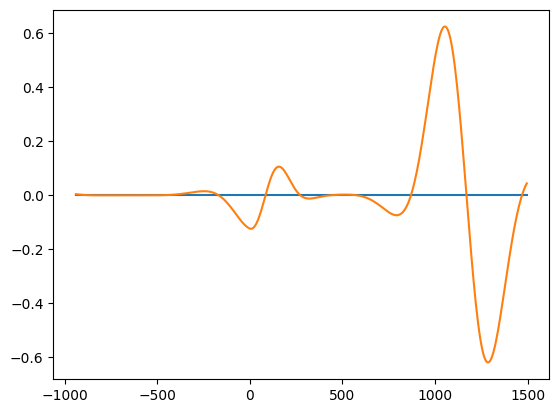

# fdtd_python

<!-- WARNING: THIS FILE WAS AUTOGENERATED! DO NOT EDIT! -->

## Developer Guide

If you are new to using `nbdev` here are some useful pointers to get you
started.

### Install fdtd_python in Development mode

``` sh
# make sure fdtd_python package is installed in development mode
$ pip install -e .

# make changes under nbs/ directory
# ...

# compile to have changes apply to fdtd_python
$ nbdev_prepare
```

## Usage

### Installation

Install latest from the GitHub
[repository](https://github.com/gbeane66/fdtd_python):

``` sh
$ pip install git+https://github.com/gbeane66/fdtd_python.git
```

or from [conda](https://anaconda.org/gbeane66/fdtd_python)

``` sh
$ conda install -c gbeane66 fdtd_python
```

or from [pypi](https://pypi.org/project/fdtd_python/)

``` sh
$ pip install fdtd_python
```

### Documentation

Documentation can be found hosted on this GitHub
[repository](https://github.com/gbeane66/fdtd_python)’s
[pages](https://gbeane66.github.io/fdtd_python/). Additionally you can
find package manager specific guidelines on
[conda](https://anaconda.org/gbeane66/fdtd_python) and
[pypi](https://pypi.org/project/fdtd_python/) respectively.

## How to use

Define the refractive index and thickness of the layers in the
simulation. The refractive index is defined as a list of floats, and the
thickness is defined as a list of floats. The length of the two lists
must be equal.

``` python
n = [1.5, 2.5]  # refractive index of the layers
d = [0.2, 500]  # thickness of the layers in micrometers
```

The fdtd settings class is used to define the simulation settings. The
class takes the following parameters: - `simulation_time`: The total
time of the simulation in picoseconds. - `simulation_size`: The size of
the simulation in micrometers. - `d`: The thickness of the layers in
micrometers. - `n`: The refractive index of the layers.

``` python
n = [1.5,2.5]
d = [0.2,500]
settings = fd.fdtd_settings(2500.,16.,d,n)
```

The simulation is then run using the function is then run using the
function
[`fdtd_run`](https://gbeane66.github.io/fdtd_python/fdtd_python.html#fdtd_run):

``` python
wavelength = 600  # wavelength in micrometers
N_w = 100  # number of points per wavelength
settings = fd.fdtd_settings(2500., 16., d, n)
fd.fdtd_run(wavelength, N_w, settings)
```

``` python
length_array, time_array, E_field = fd.fdtd_run(600, 100, settings)
```



``` python
np.shape(E_field)
```

    (407, 800)

``` python
import matplotlib.pyplot as plt
fig,ax = plt.subplots()
ax.plot(length_array, E_field[:,0], label='E-field at t=0')
ax.plot(length_array, E_field[:,600], label='E-field at t=0')
```


